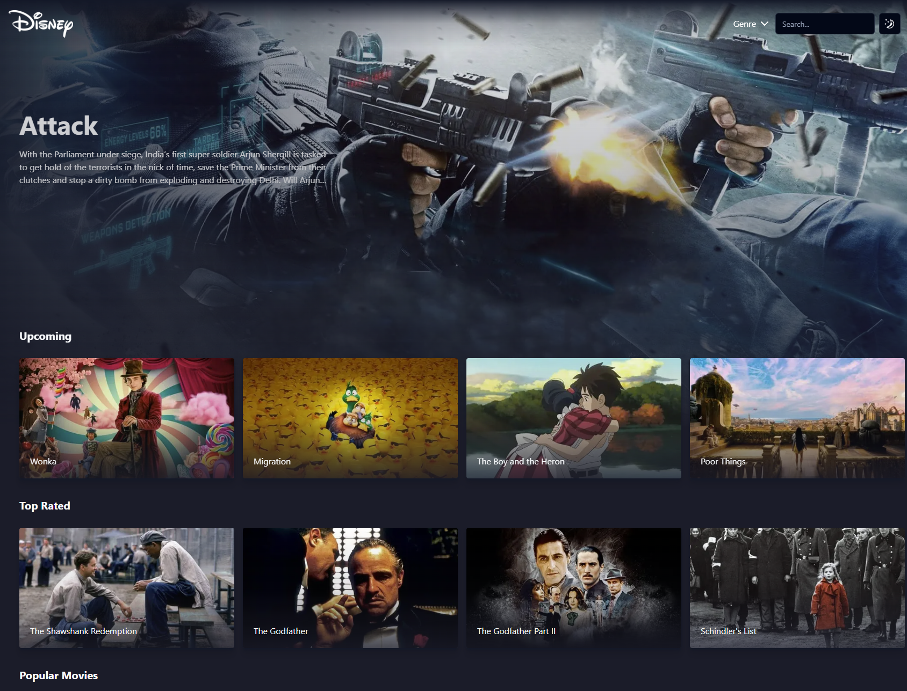
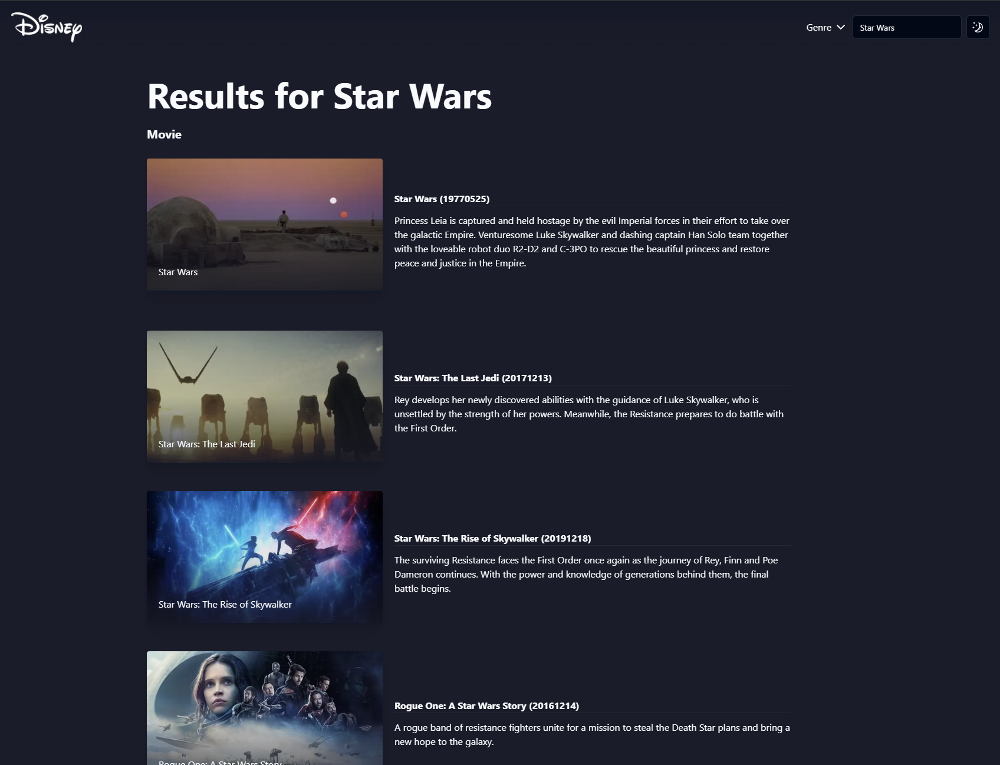
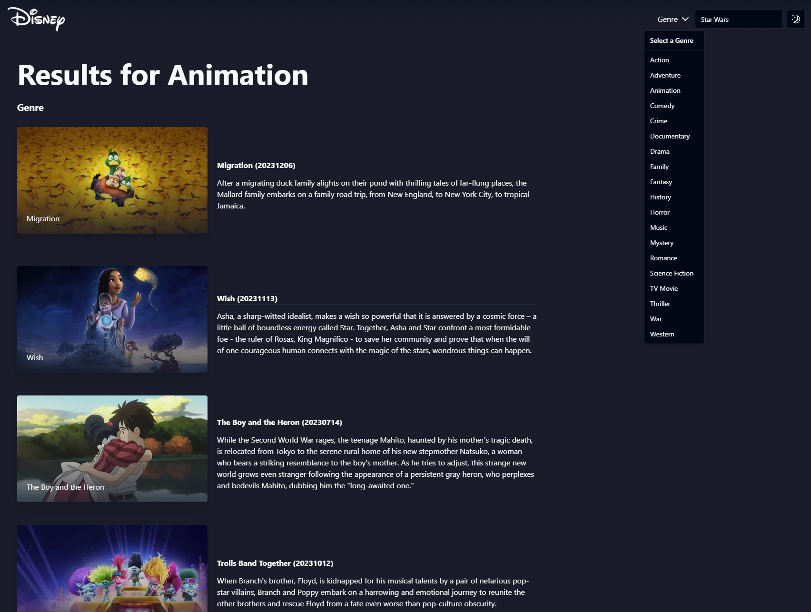

## What is this?

This applicaiton is to demonstrate my skills working with NextJS 14 also working with Typescript and Tailwind as my css library also will demonstrate my skills with Caching and also leaverage Shadcn for components. This will also laverage the TDMB API to get all out data.

To get started and run this project locally please do the below:

```bash
# Install node modules
yarn install

# Build the application
yarn build

# Start the application
yarn start
```

Open [http://localhost:3000](http://localhost:3000) with your browser to see the result.

Home page with banner carousel also get all different types of movies


Search function and API call to retrive data based on search


Gentre function to select type of movies and returns that type of film

